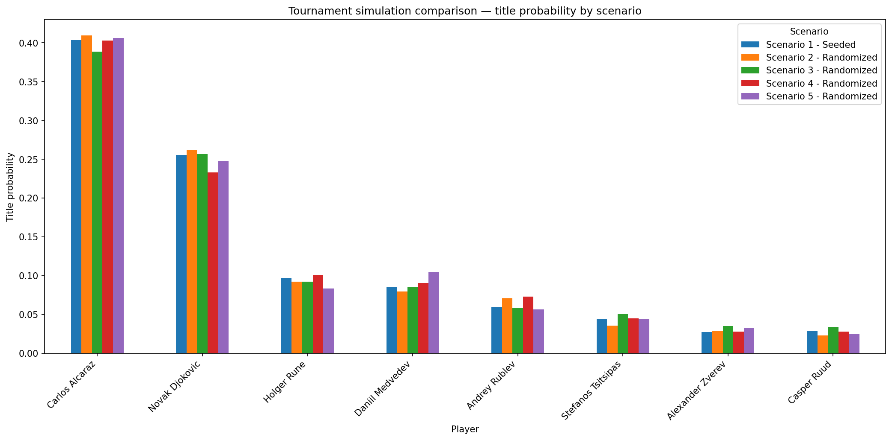
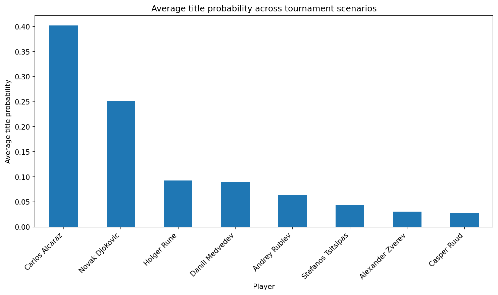

# Bayesian Tennis Tournament Predictions (Bradley–Terry)

Bayesian Bradley–Terry (BT) pipeline for **ATP tennis match prediction** and **tournament simulation**. We implement **static** and **dynamic** (time-varying) player-strength models in PyMC, optionally add **pre-match covariates**, and compare them against a **regularized frequentist BT baseline (ridge MLE)**.

---

## Project overview

This project implements a Bayesian Bradley–Terry (BT) pipeline for ATP tennis matches, with static and dynamic models of player strength and optional covariates, and compares them against a regularized frequentist BT baseline.

Each match is modeled as a **Bernoulli** event whose **log-odds** depend on the difference in latent player skill; in the dynamic model, player skills evolve over time via a **random-walk prior** over **quarterly periods**. This allows us to capture gradual changes in form across seasons and to generate calibrated probabilities for both individual matches and tournament outcomes via **posterior predictive simulation** of the draw.

---

## Team

- **Akshat Gupta**
- **Otto Miller**
- **Richard Liu**

---

## Data source

We use Jeff Sackmann’s public `tennis_atp` match dataset (ATP results). The notebook is configured to load yearly match CSVs from the GitHub raw URL (configurable in the notebook).

---

## What’s inside the notebook

### 1) Data loading & cleaning
- Loads yearly CSVs (default: **2018–2023**) and keeps the pre-match columns needed for modeling (surface, best-of, winner/loser metadata, ranks/points/age/height, etc.).
- Cleans dates and drops invalid rows.

### 2) Stable player encoding + filtering
- Encodes players using **ATP player IDs** (not names) for stability.
- Filters out sparse players (default: `MIN_MATCHES_PER_PLAYER = 8`) to reduce noise and improve inference.

### 3) Time indexing + strict out-of-time split
- Assigns discrete time periods (default **quarterly**, `TIME_FREQ = "Q"`).
- Holds out a single future tournament (default: **Wimbledon 2023**) and trains only on matches **strictly before** the tournament start date (prevents leakage).

### 4) Pairwise dataset + symmetric covariate encoding (critical)
To avoid “winner/loser ordering” bugs and to enable proper probabilistic evaluation, matches are represented in a **pairwise** view.

A safe construction is to generate two rows per match:
- Row A: `(p1=winner, p2=loser, y=1)`
- Row B: `(p1=loser,  p2=winner, y=0)`

Player-difference covariates flip sign when order flips; context covariates (e.g., surface/best-of) remain unchanged.

Covariates included (default list):
- Surface: `surf_clay`, `surf_grass`, `surf_carpet` (**Hard** as reference)
- `best_of`
- `rank_diff`, `rank_points_diff`
- `age_diff`, `height_diff`

### 5) Standardization
Continuous covariates are standardized using **training-only** statistics (no leakage).

---

## Models

### A) Static BT (Bayesian) — MCMC + VI
- One fixed skill per player: `theta[i]`
- Win probability:
  \[
  \Pr(p1 \text{ wins}) = \sigma(\theta_{p1} - \theta_{p2})
  \]
- Identifiability:
  - Uses a **zero-sum** constraint (e.g., `ZeroSumNormal`) so only differences matter.
- Inference:
  - **MCMC (NUTS)** for posterior samples
  - **VI (ADVI)** for faster approximate inference

### B) Dynamic BT (Bayesian) — time-varying skill
- Skills evolve over time periods via a **random walk**:
  \[
  \theta_{i,t} = \theta_{i,t-1} + \epsilon_{i,t}
  \]
- Identifiability:
  - Center skills per period (subtract mean across players each period).
- Prediction:
  - Predict each match using the match’s own time index `t`.

### C) Dynamic BT + Covariates (Bayesian)
Adds a linear covariate term to the BT log-odds:
\[
\text{logit}(\Pr(p1 \text{ wins})) =
(\theta_{p1,t} - \theta_{p2,t}) + \alpha + X\beta
\]
- Typical priors:
  - `beta ~ Normal(0, 0.5)` (weakly informative)

### D) Frequentist BT baseline (Ridge MLE)
- Fits BT parameters by maximizing likelihood with an **L2 (ridge)** penalty:
  \[
  \mathcal{L}(\theta) - \lambda \|\theta\|_2^2
  \]
- Provides a stable non-Bayesian benchmark.

---

## Convergence diagnostics (Bayesian models)

We run standard MCMC diagnostics to confirm the posterior samples are reliable:

### ArviZ summary (R-hat, ESS, intervals)
- `az.summary(trace)` is used to report:
  - **R-hat** (Gelman–Rubin): convergence across chains  
    - Target: **≈ 1.00** (rule-of-thumb: **< 1.01**)
  - **ESS** (effective sample size): sampling efficiency  
    - Higher is better; low ESS indicates high autocorrelation
  - Posterior mean / sd and credible intervals (HDI)

### Trace plots (mixing + stationarity)
- `az.plot_trace(trace, var_names=[...])` is generated for key parameters:
  - Static BT: `theta`
  - Dynamic BT: `sigma`, `theta_0` (and optionally selected `theta[:, t]`)
  - Covariate model: `beta_*`, `intercept`, `sigma`

A well-behaved trace shows:
- good chain mixing (overlap across chains),
- no visible drift/trends,
- stable posterior region after warm-up.

### Divergence checks (NUTS)
We monitor NUTS pathologies:
- **divergences** (should be 0; otherwise increase `target_accept` or reparameterize)
- **tree depth saturations**
- suspicious energy transitions

### Practical acceptance criteria (used in this project)
- **R-hat < 1.01** for parameters inspected
- **No (or negligible) divergences**
- **Reasonable ESS** for key parameters

> If diagnostics fail, recommended fixes include: increasing `tune`, increasing `target_accept` (e.g., 0.95), simplifying the model (fewer players/time periods), or tightening priors.

---

## Evaluation

Models are evaluated on the strictly held-out tournament using:
- **Log loss** (cross-entropy)
- **Brier score**
- **Calibration curves** (reliability plots)

Interpretation tips:
- Lower **log loss/Brier** → better probabilistic accuracy
- Calibration curve close to diagonal → well-calibrated probabilities
- VI can be faster but may be more **overconfident** than MCMC

---

## Tournament simulation

Posterior-predictive **single-elimination bracket simulation**:
- Uses posterior draws of player skills at a chosen time period
- Simulates thousands of tournament runs to estimate:
  - probability of reaching each round
  - probability of winning the title

Also supports **multiple bracket scenarios** (seeded vs randomized) and generates comparison charts.

---

## Results & assets (included in this repo)

### 1) Model evaluation summary
**File:** `evaluation_summary.csv`

| model                          |   log_loss |   brier_score |   mean_pred |   std_pred |
|:-------------------------------|-----------:|--------------:|------------:|-----------:|
| Dynamic BT — MCMC              |     0.5588 |        0.1878 |      0.5000 |     0.2544 |
| Dynamic BT + Covariates — MCMC |     0.5667 |        0.1899 |      0.5001 |     0.2445 |
| Static BT — VI                 |     0.5723 |        0.1951 |      0.5000 |     0.2054 |
| Static BT — MCMC               |     0.5724 |        0.1951 |      0.5000 |     0.2072 |
| Freq. BT — Ridge MLE           |     0.5727 |        0.1951 |      0.5000 |     0.2020 |

---

### 2) Top players by posterior mean skill (test period)
**File:** `top_players_test_period.csv`

| player             |   player_id |   skill_mean |
|:-------------------|------------:|-------------:|
| Carlos Alcaraz     |      207989 |        5.075 |
| Novak Djokovic     |      104925 |        4.583 |
| Holger Rune        |      208029 |        3.809 |
| Daniil Medvedev    |      106421 |        3.707 |
| Andrey Rublev      |      126094 |        3.537 |
| Stefanos Tsitsipas |      126774 |        3.271 |
| Zsombor Piros      |      200436 |        3.211 |
| Karen Khachanov    |      111575 |        3.208 |
| Casper Ruud        |      134770 |        3.061 |
| Alexander Zverev   |      100644 |        3.046 |

---

### 3) Example bracket simulation output
**File:** `example_bracket_simulation.csv`

| player              |   Reach R1 |   Reach R2 |   Reach R3 |   Title |
|:--------------------|-----------:|-----------:|-----------:|--------:|
| Carlos Alcaraz      |      1.000 |      0.813 |      0.615 |   0.486 |
| Daniil Medvedev     |      1.000 |      0.772 |      0.608 |   0.207 |
| Holger Rune         |      1.000 |      0.659 |      0.214 |   0.141 |
| Stefanos Tsitsipas  |      1.000 |      0.187 |      0.089 |   0.052 |
| Grigor Dimitrov     |      1.000 |      0.341 |      0.082 |   0.044 |
| Matteo Berrettini   |      1.000 |      0.583 |      0.166 |   0.035 |
| Jiri Lehecka        |      1.000 |      0.228 |      0.133 |   0.022 |
| Christopher Eubanks |      1.000 |      0.417 |      0.094 |   0.014 |

---

### 4) Multi-scenario tournament simulations (CSV + plots)

**Files:**
- `multiple_tournament_simulations.csv`
- `multiple_tournament_simulations_title_probabilities.png`
- `multiple_tournament_simulations_avg_title_probability.png`

#### Title probability by scenario


#### Average title probability across scenarios


---

## Setup & installation

Recommended: Python **3.10+**.

```bash
pip install numpy pandas scipy matplotlib scikit-learn pymc pytensor arviz numpyro
